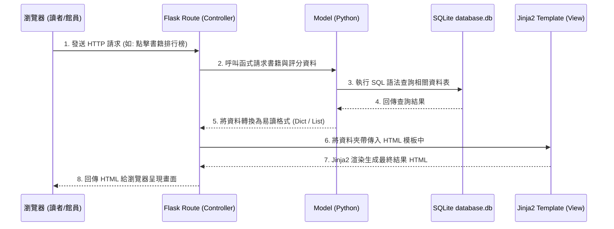

# 讀書筆記本系統 - 系統架構設計

這份文件根據 PRD 需求，說明「讀書筆記本系統」的技術架構設計、專案資料夾結構以及各個核心元件之間的運作關係。

## 1. 技術架構說明

本系統目標為打造一個功能聚焦且輕量化的 Web 應用程式，技術堆疊選用與原因如下：

- **後端框架：Python + Flask**
  輕量級、易於快速開發與迭代，非常適合我們本次的 MVP 需求與團隊協作。
- **模板引擎：Jinja2**
  Flask 內建支援的 HTML 頁面渲染引擎，能將 Python 後端的動態資料（如書名、心得、評分）快速融入前端網頁模板中，減少初期前後端分離所帶來的高開發成本。
- **資料庫：SQLite**
  無需安裝額外資料庫伺服器，資料儲存在單一檔案中，適合初期資料量不大、主要供學校圖書室內部管理與讀者查詢的應用情境。

**MVC（Model-View-Controller）模式應用**：
系統採用經典 MVC 模式來組織程式碼：
- **Model（資料模型）：** 負責存取 SQLite 資料庫，定義「書籍」、「心得評分」、「採購需求」的資料結構與操作邏輯。
- **View（視圖）：** 負責視覺呈現，由 HTML + Jinja2 模板組成，將資料渲染成網頁提供給圖書館員與讀者操作。
- **Controller（控制器）：** 由 Flask 的 Routing（路由）機制負責，接收來自網頁瀏覽器的請求（例如：提交心得表單），呼叫 Model 處理資料庫讀寫，最後決定回傳哪一張 View 畫面給使用者。

## 2. 專案資料夾結構

整個專案將依照以下架構進行切割，以利於團隊分工與後續擴展維護：

```text
web_app_development/
├── app/                  # 應用程式核心資料夾
│   ├── models/           # (Model) 資料庫模型層
│   │   ├── book.py       # 書籍與館藏庫存操作
│   │   └── review.py     # 讀者心得、評分與二度購買需求操作
│   ├── routes/           # (Controller) 路由與商業邏輯層
│   │   ├── main.py       # 首頁或共通性頁面路由
│   │   ├── book.py       # 書籍清單、新增書籍與庫存更新路由
│   │   └── review.py     # 心得發布與進書推薦路由
│   ├── templates/        # (View) Jinja2 HTML 模板層
│   │   ├── layout.html   # 全站共用的版型 (Header, Footer)
│   │   ├── home.html     # 首頁 (顯示書籍排行榜)
│   │   ├── books.html    # 書籍清單與館員後台介面
│   │   └── details.html  # 單一本書籍的心得評分詳情
│   └── static/           # 靜態資源檔案
│       ├── css/          # 樣式表 (CSS)
│       └── js/           # 前端互動腳本
├── database/             # 資料庫建立相關腳本
│   └── schema.sql        # 初始化 SQLite 資料表的 SQL 語法
├── instance/             # 存放執行期產生的動態檔案
│   └── database.db       # 系統的 SQLite 資料庫檔案
├── docs/                 # 系統開發設計文件
│   ├── PRD.md            # 產品需求文件
│   └── ARCHITECTURE.md   # 系統架構文件 (本文件)
├── app.py                # Flask 程式進入點 (主程式)
└── requirements.txt      # 記錄套件依存賴性 (如 flask)
```

## 3. 元件關係圖

以下展示當使用者（瀏覽器）發送請求時，系統內部元件如何串聯運作：



## 4. 關鍵設計決策

1. **不採用前後端分離，使用 Server-side Rendering (SSR)**
   - 原因：因應 MVP 的簡潔需求與時程壓力，使用 Jinja2 結合 Flask 可以免除 API 開發及前後端資料格式定義的煩心溝通，非常適合單體式應用的快速打樣。
2. **依功能領域拆分路由與 Model (使用 Blueprint)**
   - 原因：將不同功能的路由分至 `book.py` (管理書籍) 和 `review.py` (管理評價)，避免多人共同開發同一支冗長的 `app.py` 所造成的 Git 衝突。如此規劃可以讓組員各自建立各自的 Branch 實作分配的功能。
3. **原生 SQL 與基礎套件優先於複雜框架 (ORM)**
   - 原因：在這個階段中，我們使用原生的 `sqlite3` 以及 SQL 語法提供資料庫庫存、新增的操作，如此能幫助團隊成員直接理解 SQL 的運行邏輯與資料表間關係，更清晰地掌握系統核心技術。
