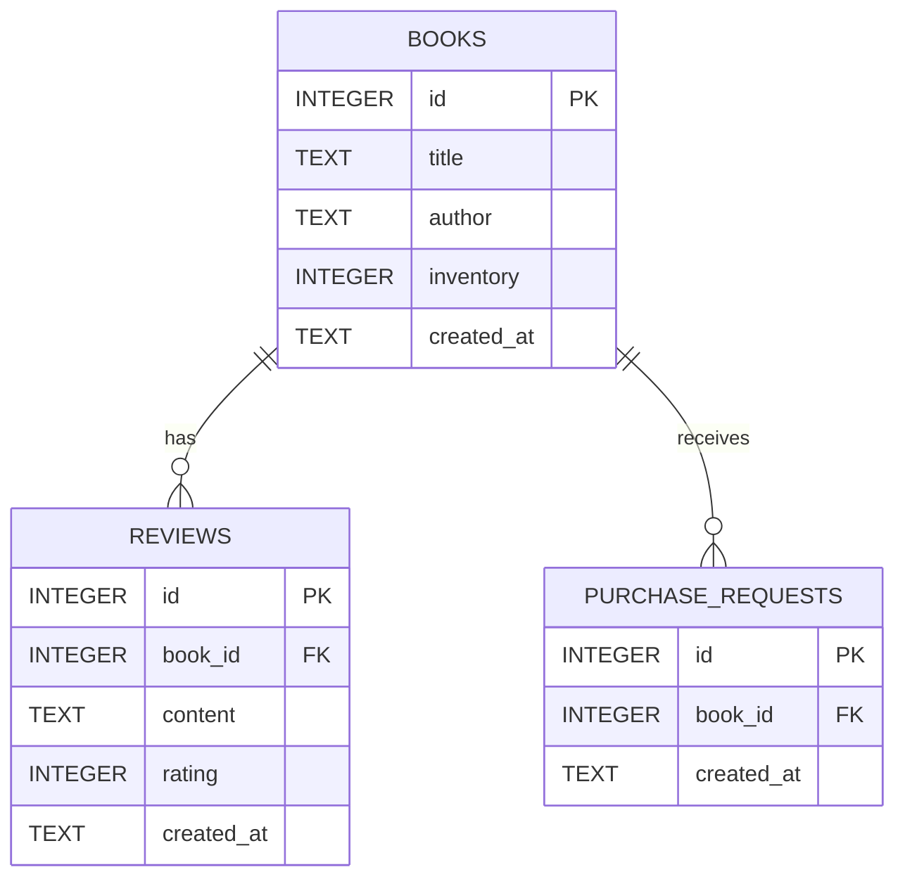

# 資料庫設計文件 (DB Design)

## 1. ER 圖

## 2. 資料表詳細說明

### BOOKS (書籍資料表)
儲存系統內所有書籍的基本資料與現有庫存。
- `id` (INTEGER): Primary Key, 自動遞增。
- `title` (TEXT): 書名，必填。
- `author` (TEXT): 作者。
- `inventory` (INTEGER): 現有庫存數量，預設為 0，必填。
- `created_at` (TEXT): 建檔時間 (ISO 8601 格式)。

### REVIEWS (心得評分表)
儲存讀者對特定書籍的反饋與評分。
- `id` (INTEGER): Primary Key, 自動遞增。
- `book_id` (INTEGER): Foreign Key，對應 `BOOKS.id`，必填。
- `content` (TEXT): 讀書心得內容，必填。
- `rating` (INTEGER): 評分 (1~5 星)，必填。
- `created_at` (TEXT): 建立時間 (ISO 8601 格式)。

### PURCHASE_REQUESTS (進書推薦表)
儲存讀者二度購買或補貨的需求紀錄。
- `id` (INTEGER): Primary Key, 自動遞增。
- `book_id` (INTEGER): Foreign Key，對應 `BOOKS.id`，必填。
- `created_at` (TEXT): 建立時間 (ISO 8601 格式)。

## 3. SQL 建表語法
請參考 `database/schema.sql` 檔案內容，裡面包含完整的 SQLite 建表邏輯以及 Foreign Key 約束設定。

## 4. Python Model 程式碼
請參考 `app/models/book.py` (書籍與館藏庫存操作) 與 `app/models/review.py` (讀者心得、評分與二度購買需求操作)。
