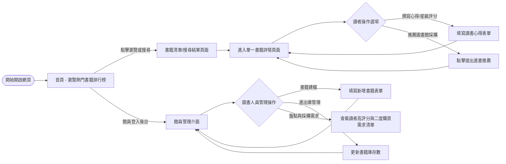
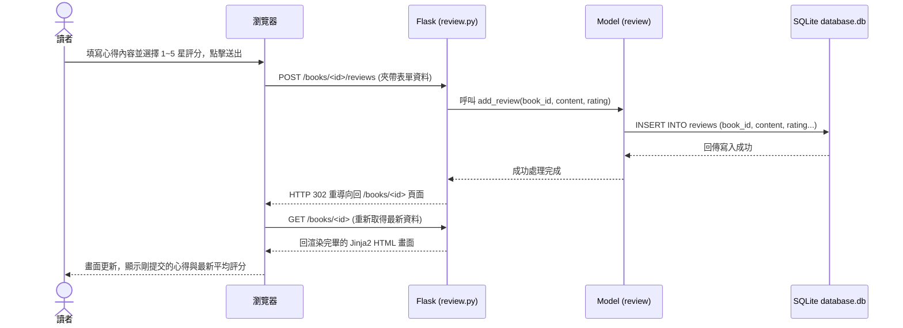

# 讀書筆記本系統 - 流程圖設計

本文件根據 PRD 與系統架構設計（ARCHITECTURE），定義了「讀書筆記本系統」的使用者操作路徑（User Flow）、系統序列圖（Sequence Diagram）以及詳細的功能與 API 對應清單，確保後續實作階段能夠清楚了解資料流動與使用者體驗。

## 1. 使用者流程圖（User Flow）

此流程圖描述了「讀者」與「圖書人員」在系統內主要的瀏覽步驟與操作路徑。

## 2. 系統序列圖（Sequence Diagram）

此序列圖描述核心功能：「從讀者在書籍詳情頁準備提交讀書心得與評分，到資料庫成功儲存並重新渲染畫面」的完整系統資料流。

## 3. 功能清單對照表

下表列出系統所有核心功能其對應的 URL 路徑、HTTP 方法與負責處理該請求的 Router。

| 功能名稱 | URL 路徑 (範例) | HTTP 方法 | 對應 Route | 描述 |
| ------ | ------------- | -------- | --------- | ---- |
| **首頁 (排行榜)** | `/` | GET | `main.py` | 顯示全站評價最高或最受歡迎（最多人評論）的書籍列表 |
| **書籍清單/搜尋** | `/books` | GET | `book.py` | 列出系統內書籍，並可依書名、作者進行查詢 |
| **單一書籍詳情** | `/books/<id>` | GET | `book.py` | 顯示書籍詳細資訊、歷史評論、平均評分與當前庫存 |
| **新增書籍 (建檔)** | `/books/new` | GET, POST | `book.py` | 館員進入建檔表單，並透過 POST 接收資料存入庫 |
| **更新書籍庫存** | `/books/<id>/inventory` | POST | `book.py` | 圖書人員透過表單或按鈕快速更新該書籍庫存數量 |
| **新增讀書心得/評分** | `/books/<id>/reviews` | POST | `review.py` | 讀者提交特定書籍的文字心得與 1~5 星評級 |
| **提出進書推薦/補貨需求** | `/books/<id>/recommend` | POST | `review.py` | 讀者針對缺貨或喜愛的原書點選按鈕，紀錄「二度購買需求」 |
| **館員採購/熱門清單** | `/admin/reports` | GET | `main.py` / `book.py`| 圖書館員專屬頁面，統整需補貨、被推薦採購或高評分的清單 |
